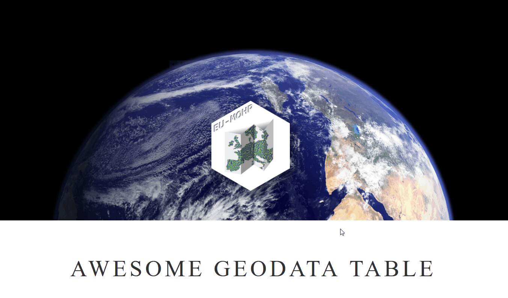

<!-- README.md is generated from README.Rmd. Please edit that file -->

```{r, include = FALSE}
knitr::opts_chunk$set(
  collapse = TRUE,
  comment = "#>",
  fig.path = "man/figures/README-",
  out.width = "100%"
)
```

# Awesome Geodata Table 

<!-- badges: start -->

[](https://lifecycle.r-lib.org/articles/stages.html#experimental)
`r badger::badge_repostatus("Active")`
`r badger::badge_last_commit("MxNl/awesome_geodata_table")`
`r badger::badge_license("CC BY 4.0")`
<!-- badges: end -->

# What is it good for?

The **Awesome Geodata Table** is a searchable collection of geo data sets. If you are searching for spatial data sets for your research project, you can enter search terms or use the column filters to scan through the underlying data collection. But be aware that it just provides a collection of meta data and information on where to download the data. It does not provide the data itself. Its initial purpose was to collect data sets that could be used as environmental predictors or features in machine learning applications.

# How to use the table?

Just open the [**Awesome Geodata Table**](https://mxnl.github.io/awesome_geodata_table/) and search for data sets or use the column filters to narrow your search.
<br><br>



# How to add entries to the table?

## Step-by-step

  1. Copy the content of the following code chunk by using the button at the top right
```{r, eval=FALSE}
Name: <Name of the dataset (character)>
Tags: <Tags related to the dataset (character: maximum three comma-separated tags)>
Domain: <first associated domain (character: maximum one word)>
Resolution_temporal_min: <minimum temporal resolution (character: see details)>
Resolution_temporal_max: <minimum temporal resolution (character: see details)>
Resolution_spatial_min: <spatial resolution in meters (numeric: single number)>
Resolution_spatial_max: <spatial resolution in meters (numeric: single number)>
Extent_temporal_start: <Start of the covered period (date: single date in format YY-MM-DD)>
Extent_temporal_end: <End of the covered period (date: single date in format YY-MM-DD)>
Extent_spatial_spatial: <Name of the covered region (character: maximum one word)>
Data_Data type: < ( : )>
Data_Data format: < ( : )>
Data_File extension: < ( : )>
Data_Data link: < ( : )>
Publication Year: < ( : )>
Publication link: < ( : )>
Version updates: < ( : )>
Upload frequency: < ( : )>
Temporal type: < ( : )>
Access: < ( : )>
Publisher: < ( : )>
Data limitations: < ( : )>
Method: < ( : )>
Usage requirement: < ( : )>
Comment: < ( : )>
```
  
  2. Go to the directory [inst/extdata/new_entries](https://github.com/MxNl/awesome_geodata_table/tree/main/inst/extdata/new_entries)
  3. Click on `Add file` -> `Create new file`
  4. Enter a file name (!Please don't use spaces) and use the file extension .yml
  5. Paste the previously copied text into the file and replace the placeholders with the meta data of the dataset that you want to add.
  6. When entered all meta data and finished editing of that file, scroll down and select `Create a new branch for this commit and start a pull request.`
  7. Click on `Propose new file`
  8. Click on `Create pull request`

One of the administrators of this repository will then add your new entry! We might need to make some minor changes to the entered meta data in case it doesn't match the requirements on the column specifications.

## Detailed column specifications

Text...

# Citation

Please cite this table using the following bibtex entry:
```{r, eval = FALSE}
  @Manual{,
    title = {awesome_geodata_table A Searchable Collection of Geodatasets Maintained by its Community},
    author = {Anne-Karin Cooke and Sandra Willkommen and Mariana Gomez-Ospina and Maximilian Nölscher},
    year = {2022},
    note = {R package version 0.0.0.9000},
    url = {https://github.com/MxNl/awesome_geodata_table},
  }
```


```{r, include=FALSE}
# citation("awesome_geodata_table")
```
