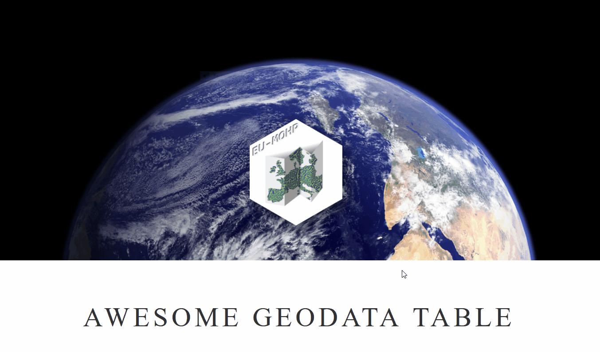

<!-- README.md is generated from README.Rmd. Please edit that file -->

# Awesome Geodata Table 

<!-- badges: start -->


[](https://lifecycle.r-lib.org/articles/stages.html#experimental)
[](https://www.repostatus.org/#active)
[](https://github.com/MxNl/awesome_geodata_table/commits/main)
[](https://cran.r-project.org/web/licenses/CC%20BY%204.0)
<!-- badges: end -->

# What is it good for?

The **Awesome Geodata Table** is a searchable collection of geo data
sets. If you are searching for spatial data sets for your research
project, you can enter search terms or use the column filters to scan
through the underlying data collection. But be aware that it just
provides a collection of meta data and information on where to download
the data. It does not provide the data itself. Its initial purpose was
to collect data sets that could be used as environmental predictors or
features in machine learning applications.

# How to use the table?

Just open the [**Awesome Geodata
Table**](https://mxnl.github.io/awesome_geodata_table/) and search for
data sets or use the column filters to narrow your search. <br><br>


# How to add entries to the table?

## Step-by-step

1.  Copy the content of the following code chunk by using the button at
    the top right

``` {r}
generate_entry_description()
```

Name: \<Full name of the dataset with optional abbreviation in round
brackets (data type: teeeeeeext)> Covered_Variables: \<Name of a single
parameter/variable in the dataset (data type: teeeeeeext)> Tags: \<Tags
related to the dataset (data type: teeeeeeext)> Domain: \<Strongest
associated domain (data type: teeeeeeext)> Resolution-temporal-min:
\<Minimum temporal resolution (data type: teeeeeeext)>
Resolution-temporal-max: \<Maximum temporal resolution (data type:
teeeeeeext)> Resolution-spatial-min\_\[m\]: \<Minimum spatial resolution
in meters (data type: teeeeeeext)> Resolution-spatial-max\_\[m\]:
\<Maximum spatial resolution in meters (data type: teeeeeeext)>
Resolution-spatial-unconverted_units: \<Raw units of the spatial
resolution (data type: teeeeeeext)> Resolution-spatial-vertical:
\<Vertical spatial resolution (data type: teeeeeeext)>
Extent-temporal-start: \<Start of the covered period (data type:
teeeeeeext)> Extent-temporal-end: \<End of the covered period (data
type: teeeeeeext)> Extent-spatial: \<teeeeext (data type: teeeeeeext)>
Data-type: \<teeeeext (data type: teeeeeeext)> Data-format: \<teeeeext
(data type: teeeeeeext)> Data-file_extension: \<teeeeext (data type:
teeeeeeext)> Download_link: \<teeeeext (data type: teeeeeeext)>
Literatur-year\_(first): \<teeeeext (data type: teeeeeeext)>
Literatur-link: \<teeeeext (data type: teeeeeeext)> Version_updates:
\<teeeeext (data type: teeeeeeext)> Upload_frequency: \<teeeeext (data
type: teeeeeeext)> Temporal_type: \<teeeeext (data type: teeeeeeext)>
Access: \<teeeeext (data type: teeeeeeext)> Publisher: \<teeeeext (data
type: teeeeeeext)> Data_limitations: \<teeeeext (data type: teeeeeeext)>
Method: \<teeeeext (data type: teeeeeeext)> Usage_requirement:
\<teeeeext (data type: teeeeeeext)> minTempRes: \<teeeeext (data type:
teeeeeeext)> maxTempRes: \<teeeeext (data type: teeeeeeext)> Comment:
\<teeeeext (data type: teeeeeeext)>`{r}`

asdasda

    Name: <Full name of the dataset with optional abbreviation in round brackets (data type: teeeeeeext)>
    Covered_Variables: <Name of a single parameter/variable in the dataset (data type: teeeeeeext)>
    Tags: <Tags related to the dataset (data type: teeeeeeext)>
    Domain: <Strongest associated domain (data type: teeeeeeext)>
    Resolution-temporal-min: <Minimum temporal resolution (data type: teeeeeeext)>
    Resolution-temporal-max: <Maximum temporal resolution (data type: teeeeeeext)>
    Resolution-spatial-min_[m]: <Minimum spatial resolution in meters (data type: teeeeeeext)>
    Resolution-spatial-max_[m]: <Maximum spatial resolution in meters (data type: teeeeeeext)>
    Resolution-spatial-unconverted_units: <Raw units of the spatial resolution (data type: teeeeeeext)>
    Resolution-spatial-vertical: <Vertical spatial resolution (data type: teeeeeeext)>
    Extent-temporal-start: <Start of the covered period (data type: teeeeeeext)>
    Extent-temporal-end: <End of the covered period (data type: teeeeeeext)>
    Extent-spatial: <teeeeext (data type: teeeeeeext)>
    Data-type: <teeeeext (data type: teeeeeeext)>
    Data-format: <teeeeext (data type: teeeeeeext)>
    Data-file_extension: <teeeeext (data type: teeeeeeext)>
    Download_link: <teeeeext (data type: teeeeeeext)>
    Literatur-year_(first): <teeeeext (data type: teeeeeeext)>
    Literatur-link: <teeeeext (data type: teeeeeeext)>
    Version_updates: <teeeeext (data type: teeeeeeext)>
    Upload_frequency: <teeeeext (data type: teeeeeeext)>
    Temporal_type: <teeeeext (data type: teeeeeeext)>
    Access: <teeeeext (data type: teeeeeeext)>
    Publisher: <teeeeext (data type: teeeeeeext)>
    Data_limitations: <teeeeext (data type: teeeeeeext)>
    Method: <teeeeext (data type: teeeeeeext)>
    Usage_requirement: <teeeeext (data type: teeeeeeext)>
    minTempRes: <teeeeext (data type: teeeeeeext)>
    maxTempRes: <teeeeext (data type: teeeeeeext)>
    Comment: <teeeeext (data type: teeeeeeext)>

sdfsdd

    Name: <Full name of the dataset with optional abbreviation in round brackets (data type: teeeeeeext)>
    Covered_Variables: <Name of a single parameter/variable in the dataset (data type: teeeeeeext)>
    Tags: <Tags related to the dataset (data type: teeeeeeext)>
    Domain: <Strongest associated domain (data type: teeeeeeext)>
    Resolution-temporal-min: <Minimum temporal resolution (data type: teeeeeeext)>
    Resolution-temporal-max: <Maximum temporal resolution (data type: teeeeeeext)>
    Resolution-spatial-min_[m]: <Minimum spatial resolution in meters (data type: teeeeeeext)>
    Resolution-spatial-max_[m]: <Maximum spatial resolution in meters (data type: teeeeeeext)>
    Resolution-spatial-unconverted_units: <Raw units of the spatial resolution (data type: teeeeeeext)>
    Resolution-spatial-vertical: <Vertical spatial resolution (data type: teeeeeeext)>
    Extent-temporal-start: <Start of the covered period (data type: teeeeeeext)>
    Extent-temporal-end: <End of the covered period (data type: teeeeeeext)>
    Extent-spatial: <teeeeext (data type: teeeeeeext)>
    Data-type: <teeeeext (data type: teeeeeeext)>
    Data-format: <teeeeext (data type: teeeeeeext)>
    Data-file_extension: <teeeeext (data type: teeeeeeext)>
    Download_link: <teeeeext (data type: teeeeeeext)>
    Literatur-year_(first): <teeeeext (data type: teeeeeeext)>
    Literatur-link: <teeeeext (data type: teeeeeeext)>
    Version_updates: <teeeeext (data type: teeeeeeext)>
    Upload_frequency: <teeeeext (data type: teeeeeeext)>
    Temporal_type: <teeeeext (data type: teeeeeeext)>
    Access: <teeeeext (data type: teeeeeeext)>
    Publisher: <teeeeext (data type: teeeeeeext)>
    Data_limitations: <teeeeext (data type: teeeeeeext)>
    Method: <teeeeext (data type: teeeeeeext)>
    Usage_requirement: <teeeeext (data type: teeeeeeext)>
    minTempRes: <teeeeext (data type: teeeeeeext)>
    maxTempRes: <teeeeext (data type: teeeeeeext)>
    Comment: <teeeeext (data type: teeeeeeext)>

2.  Go to the directory
    [inst/extdata/new_entries](https://github.com/MxNl/awesome_geodata_table/tree/main/inst/extdata/new_entries)
3.  Click on `Add file` -> `Create new file`
4.  Enter a file name (!Please don’t use spaces) and use the file
    extension .yml
5.  Paste the previously copied text into the file and replace the
    placeholders with the meta data of the dataset that you want to add.
6.  When entered all meta data and finished editing of that file, scroll
    down and select
    `Create a new branch for this commit and start a pull request.`
7.  Click on `Propose new file`
8.  Click on `Create pull request`

One of the administrators of this repository will then add your new
entry! We might need to make some minor changes to the entered meta data
in case it doesn’t match the requirements on the column specifications.

## Detailed column specifications

Text…

# Citation

Please cite this table using the following bibtex entry:

``` r
  @Manual{,
    title = {awesome_geodata_table A Searchable Collection of Geodatasets Maintained by its Community},
    author = {Anne-Karin Cooke and Sandra Willkommen and Mariana Gomez-Ospina and Maximilian Nölscher},
    year = {2022},
    note = {R package version 0.0.0.9000},
    url = {https://github.com/MxNl/awesome_geodata_table},
  }
```
